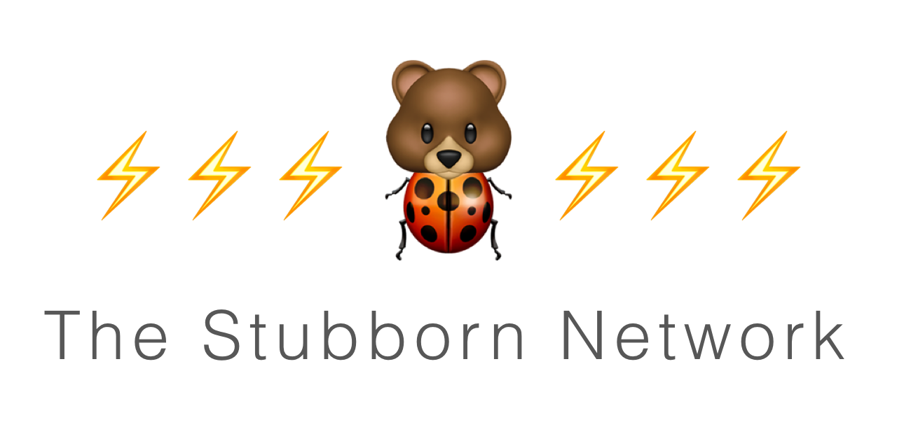

 [](https://app.sourcelevel.io/github/q231950/-/the-stubborn-network)

 


> An opiniated stubbing machine.

**The Stubborn Network** makes your _SwiftUI development more efficient_ and _UI tests more reliable_ by stubbing responses of your network requests. It makes it _easy to record new stubs_ and it speeds things up!

## 👩🏻‍🎨 Stubbed UI Tests

UI tests benefit from **The Stubborn Network**'s ability to easily record actual network requests and then play them back. This makes your tests more stable and the backend won't interfere with you testing the flow of your application. 

In order to record and playback stubs you need to

- configure your `URLSession` to use **The Stubborn Network**'s  `URLProtocol` in your network layer when running tests
- the tests on the other hand are required to inform **The Stubborn Network** which _stub sources_, in other words - which stubs to use for which test case

### App Configuration

The custom `URLProtocol` will make your standard `URLSession` of your network client a stubbed variant during UI test execution. This happens inside your application:

<details><summary>Example how to set the custom URL protocol</summary>
<p>

```swift
let configuration = URLSessionConfiguration.default

if ProcessInfo().isUITesting {
    StubbornNetwork.standard.insertStubbedSessionURLProtocol(into: configuration)
    StubbornNetwork.standard.bodyDataProcessor = SensitiveDataProcessor()
    StubbornNetwork.standard.requestMatcherOptions = RequestMatcherOptions([.requestBody, .url, .httpMethod])
}

let urlSession = URLSession(configuration: configuration)
```

</p>
</details>

### Test Configuration

There are 3 parameters passed in as environment variables to the application under test in order to specify that we want to stub network responses, what to stub, where to find/place them. Some of these will be handled more elegantly in the future:

1. each test assigns its function name to `STUB_NAME` to create a dedicated stub source with stubs for network requests of each individual test case
2. the `"STUB_PATH"` points to the directory where the stub source with the stubs is stored
3. the `THE_STUBBORN_NETWORK_UI_TESTING` parameter simply indicates to the application (see _App Configuration_ above) that we are in a test environment. This is useful to separate between testing and debug/release modes on the other hand 

<details><summary>Example UI Test</summary>
<p>

```swift
override func setUp() {
    super.setUp()

    app = XCUIApplication()
    setupSnapshot(app)

    let processInfo = ProcessInfo()
    app.launchEnvironment["STUB_NAME"] = self.name
    app.launchEnvironment["STUB_PATH"] = "\(processInfo.environment["PROJECT_DIR"] ?? "")/BTLBUITests/Stubs"
    app.launchEnvironment["THE_STUBBORN_NETWORK_UI_TESTING"] = "YES"

    app.launch()
}

func testBytesText() {
    /// In the test itself nothing needs to be changed
    app.buttons["Download"].tap()

    let bytesText = app.staticTexts["417 bytes"]
    wait(forElement:bytesText, timeout:1)
}
```

</p>
</details>

## Re-record Stubs

If a stub needs to be re-recorded it's as easy as just deleting it!

You can find your stubs at the path defined in the test cases and they typically look similar to this this:

`XZYUITests_testABC.json`

`XZYUITests` is the name of your test case (`XCTestCase`) and `testABC` the name of the test (the test function).

## Contribute

### Run Tests

You can run tests either from within Xcode (`cmd+U`) or from the command line: `export STUB_DIR='./stubs' && swift test`.

Stubs are stored and read during test execution. They can be found in a temporary directory, for example: `"file:///private/tmp/StubbornNetworkTests/67BED946-88E0-4F8C-98C7-7A23812D647A-3620-000001390930169C"`
